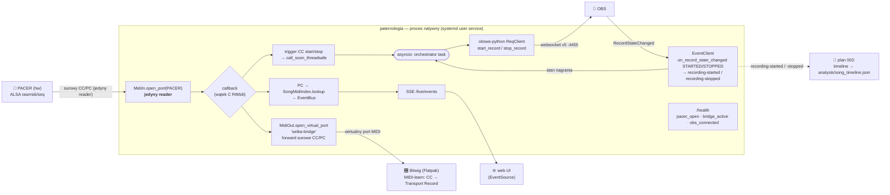

# feat: Orkiestracja nagrywania OBS + Bitwig + paternologia (Model A)

## Overview

Czynimy paternologię centralną władzą MIDI i orchestratorem nagrywania. paternologia staje
się **jedynym czytelnikiem sprzętowego portu PACER** i robi fan-out CC/PC do Bitwiga przez
**wirtualny port ALSA seq** (rozwiązuje konflikt raw vs seq). Dedykowany przycisk PACER startuje
nagrywanie w **OBS** (przez obs-websocket v5) i w **Bitwigu** (transport record przez MIDI
mapping na porcie mostka); drugi przycisk zatrzymuje oba. paternologia zostaje przeniesiona do
setka-monorepo jako pakiet uv workspace.

> **Zakres wydzielony:** timeline zmian utworu/patternu (origin R4) + kwantyzacja czasu względem
> słyszalnej zmiany żyją w osobnym planie:
> `docs/plans/2026-05-31-002-feat-recording-song-timeline-plan.md` (zależy od fundamentu z tego planu).

## Problem Frame

(zob. origin: `docs/brainstorms/2026-05-31-midi-recording-orchestration-requirements.md`)

Wojtas gra live na sprzętowym rigu MIDI (PACER = master CC, RC-600 = master clock, M:S,
MicroFreak, LCXL3) i nagrywa w OBS. Dziś: (1) start OBS i Bitwiga to dwie ręczne akcje;
(2) paternologia (`rtmidi`/ALSA seq) i Bitwig (dostęp raw) walczą o port PACER →
`Device or resource busy`. Ten plan rozwiązuje (1) i (2) — fundament Model A + one-button record.
Maszynowy, zsynchronizowany z nagraniem zapis stanu utworu (origin R4) jest wydzielony do osobnego
planu (zob. Overview).

## Requirements Trace

- **R1.** paternologia = jedyny właściciel/czytelnik fizycznego PACER; re-broadcast CC/PC do
  Bitwiga przez stabilny wirtualny port MIDI; Bitwig nie otwiera sprzętowego PACER.
- **R2.** Dedykowany przycisk PACER startuje OBS (`StartRecord`) + Bitwig (transport record)
  jednym ruchem; drugi dedykowany przycisk zatrzymuje oba. Bitwig minimum: transport record;
  nice-to-have: arm wszystkich ścieżek.
- **R3.** paternologia wyprowadza bieżący utwór/pattern z PACER (PC → utwór) i pokazuje go live
  przez istniejące web UI (SSE `/live/events`); front nie używa Web MIDI.
- **R4** *(wydzielone)* — timeline zmian utworu/patternu + kwantyzacja czasu: zob.
  `docs/plans/2026-05-31-002-feat-recording-song-timeline-plan.md`.
- **R5.** paternologia przeniesiona do setka-monorepo jako pakiet uv workspace, reużywa
  `RecordingStructureManager`.
- **R6.** Niezawodność live: ścieżka fan-out + trigger przetrwają występ; paternologia
  auto-startuje i sygnalizuje stan zdrowia.

## Scope Boundaries

- **Bez** integracji stanu utworu w fermacie (web UI zostaje; fermata jako orchestrator
  odłożona — `process_runner` używa blokującego `cmd.output()`, nieodpowiedniego dla daemona).
- **Bez** overlay/browser-source w OBS.
- **Bez** zmian w routingu clock/transport RC-600 ani w plumbingu Doremidi.
- **Bez** generowania projektów Bitwiga / DAWproject.
- **Bez** OSC/DrivenByMoss (Model A używa wirtualnego MIDI).
- Arm-all w Bitwigu jako **opcjonalna, odłożona** noga (wymaga Controller Extension).
- **Bez** timeline utworów/patternów i kwantyzacji czasu (origin R4) — wydzielone do
  `docs/plans/2026-05-31-002-feat-recording-song-timeline-plan.md` (zależy od fundamentu z tego planu).

## Context & Research

### Relevant Code and Patterns

- **uv workspace — 3 miejsca edycji** w `packages/.../` root manifeście
  `/home/wojtas/dev/setka-monorepo/pyproject.toml`: `[tool.uv.workspace].members`,
  `[tool.uv.sources]` (`paternologia = { workspace = true }`),
  `[tool.pytest.ini_options]` (`testpaths` + `pythonpath`). Wzorzec do skopiowania: wpisy
  `cymatic`. Markery pytest (`unit, integration, audio, manual, asyncio`) są root-wide.
- **Per-package template:** `packages/cymatic/pyproject.toml` (hatchling, `[tool.hatch.build.targets.wheel] packages=["src/<name>"]`,
  `[project.scripts]`, `[tool.hatch.metadata] allow-direct-references=true`). paternologia **już**
  używa hatchling z `packages=["src/paternologia"]` — backend zgodny.
- **OBS start time (dziś):** `packages/obsession/src/obsession/obs_integration/obs_script.py` —
  to **in-process skrypt OBS** (`obspython`), nie klient websocket; łapie
  `OBS_FRONTEND_EVENT_RECORDING_STARTED/STOPPED`, stempluje `recording_start_time = time.time()`.
  **Nowy klient obs-websocket to greenfield** — brak istniejącego klienta w całym repo.
- **paternologia (`~/dev/paternologia/src/paternologia/`):** `main.py` (`lifespan` buduje
  `EventBus`, `SongMidiIndex`, startuje `MidiListener`; `BASE_DIR=parent.parent.parent` — kruche
  poza repo), `dependencies.py` (`BASE_DIR/DATA_DIR/TEMPLATES_DIR` z `__file__` — pękają przy
  przenosinach), `storage.py` (`Storage(data_dir="data")`: `devices.yaml`, `songs/*.yaml`,
  `pacer.yaml`), `models.py` (`Device.midi_channel`, `Action(preset|pattern|cc|note)`,
  `PacerConfig(device_name="PACER")`), `midi/listener.py` (`MidiListener.start(name)` otwiera
  pierwszy pasujący port rtmidi, `_callback` filtruje PC `0xC0` → `SongMidiIndex.lookup` →
  `bus.publish_threadsafe`; jest też `start_virtual()`), `midi/ports.py`
  (`find_rtmidi_port`/`find_amidi_port`), `midi/events.py` (`EventBus` z `loop.call_soon_threadsafe`,
  `MidiEvent(song_id,channel,program,timestamp)`), `midi/index.py` (`SongMidiIndex.build/lookup`,
  `channel = device.midi_channel-1`), `routers/live.py` (`/live/events` SSE `StreamingResponse`,
  `event: song-change`), `routers/pacer.py` (`amidi` subprocess do SysEx). 14 plików testów,
  `asyncio_mode="auto"`, `start_virtual` w `test_midi_listener.py`.
- **`.gitmodules`** istnieje w paternologii (submoduł) — rozwiązać przed wendorowaniem.
- **`packages/proteus/`** — pusty zarezerwowany stub (tylko `.python-version`), **nie** w
  `members`/`sources`. Nic go nie importuje.

### Institutional Learnings

- **Brak `docs/solutions/`** — to greenfield. (Precedens dowodu timingu z cymatic
  `test_sync_verification.py` dotyczy weryfikacji timeline → przeniesiony do planu 002.)
- Brak jakiegokolwiek precedensu FastAPI lifespan / background listener / rtmidi virtual /
  obs-websocket w repo.

### External References

- **Wirtualny port MIDI:** `python-rtmidi` `MidiOut.open_virtual_port(name)` tworzy port ALSA
  **seq** należący do procesu — żyje tak długo jak proces, **niezależnie od replugu PACER**.
  `snd-virmidi` (jądrowy) tylko jako fallback gdy Bitwig nie re-subskrybuje po crashu hosta.
  Unikać `aconnect` w skryptach startowych (dodatkowy punkt awarii). Adresować porty po nazwie,
  nie indeksie (indeksy przesuwają się przy replug).
  ([python-rtmidi docs](https://spotlightkid.github.io/python-rtmidi/rtmidi.html),
  [ALSA Virmidi](https://alsa.opensrc.org/Virmidi))
- **Konflikt raw vs seq:** ALSA **rawmidi** jest ekskluzywny per kierunek → `-EBUSY`. Warstwa
  **seq** ma model subskrypcyjny (wielu subskrybentów) → fan-out naturalny.
  ([ALSA rawmidi](https://www.alsa-project.org/alsa-doc/alsa-lib/rawmidi.html))
- **Flatpak Bitwig:** manifest Flathub przyznaje **`--device=all`** → widzi `/dev/snd/seq`, więc
  **widzi wirtualne porty seq** hosta. Trzymać host Pythona **natywnie** (poza Flatpakiem).
  Stała, jawna nazwa portu seq (rawmidi/virmidi bywa pusty wpis w Bitwigu).
  ([flathub manifest](https://github.com/flathub/com.bitwig.BitwigStudio))
- **obs-websocket v5 + `obsws-python`** (sync, v5-only; `ReqClient` + `EventClient`): auth liczona
  przez lib; `start_record()`/`stop_record()` (stop zwraca `output_path`); event
  `RecordStateChanged` (`output_active`, `output_state`
  `OBS_WEBSOCKET_OUTPUT_STARTED/STOPPED`, `output_path`). **Czas startu = przyjście eventu
  STARTED**, ostemplowane własnym zegarem monotonicznym (nie czas wysłania żądania; `outputDuration`
  bywa 0 tuż po starcie). Idempotencja: sprawdź `output_active` przed `StartRecord`. Brak wbudowanego
  reconnect → pętla try/except + backoff.
  ([protocol.md](https://github.com/obsproject/obs-websocket/blob/master/docs/generated/protocol.md),
  [obsws-python](https://github.com/aatikturk/obsws-python))
- **Bitwig record:** generic MIDI **mapping (learn)** CC/note → Transport Record **działa bez
  kodu**. **Arm-all** nie ma natywnego MIDI targetu → wymaga **Controller Extension API**
  (`createTrackBank` → iteracja `Track.arm().set(true)`, potem `Transport.record()`).
  ([Bitwig MIDI controllers](https://www.bitwig.com/userguide/latest/midi_controllers/),
  [typed-bitwig-api](https://github.com/joslarson/typed-bitwig-api))
- **FastAPI:** `lifespan` (`@asynccontextmanager`) jako właściciel uchwytów MIDI/OBS w procesie;
  callback rtmidi żyje w **wątku C** → most do asyncio przez `loop.call_soon_threadsafe` +
  `asyncio.Queue`. SSE: `StreamingResponse(..., media_type="text/event-stream")` (już używane).
  ([FastAPI events](https://fastapi.tiangolo.com/advanced/events/))
- **systemd user service:** `Restart=always`, `RestartSec=2`, watchdog `Type=notify` +
  `WatchdogSec` z heartbeatem **z pętli MIDI** (łapie zawiśnięcia), `loginctl enable-linger`.
  ([systemd watchdog](http://0pointer.de/blog/projects/watchdog.html))

## Key Technical Decisions

- **KTD1 — fan-out do portu, który Bitwig WIDZI (ZREWIDOWANE 2026-06-02 po teście na sprzęcie).**
  `open_virtual_port` (czysty seq) okazał się **niewidoczny dla Bitwiga** — Bitwig na Linuksie
  enumeruje tylko porty rawmidi/sprzętowe, nie wirtualne porty seq (to nie sandbox Flatpaka,
  `--device=all` jest nadane). Dlatego **`snd-virmidi` jest ścieżką główną, nie fallbackiem**:
  most (`MidiBridge`) otwiera pierwszy port `VirMIDI` (`open_port`), a Bitwig czyta sprzętową
  stronę `hw:Virmidi` („Virtual Raw MIDI 1"). Fallback do `open_virtual_port` zostaje, gdy
  virmidi nieobecny (konsumenci seq-aware). Port nadal należy do procesu → przeżywa replug.
  Pełna analiza: [docs/solutions/2026-06-02-bitwig-alsa-seq-invisible-virmidi-bridge.md](../solutions/2026-06-02-bitwig-alsa-seq-invisible-virmidi-bridge.md).
- **KTD2 — paternologia jedynym czytelnikiem sprzętu**: w jednym procesie `MidiIn.open_port(PACER)`
  + `MidiOut.open_virtual_port("setka-bridge")`; callback forwarduje surowe CC/PC. To eliminuje
  `EBUSY` z definicji (Bitwig dotyka tylko portu mostka).
- **KTD3 — `obsws-python`** (sync) nad `simpleobsws`(async)/`obs-websocket-py`(v4+v5): czystszy
  wzorzec snake_case, łatwiejsza integracja z wątkiem MIDI.
- **KTD4 — autorytatywny moment startu = event `RecordStateChanged` STARTED**, ostemplowany zegarem
  monotonicznym paternologii; idempotencja przez `output_active`. Ten moment napędza stan nagrania
  (UI/`/health`) i jest punktem zaczepienia `t0` dla wydzielonego planu timeline (002).
- **KTD5 — systemd user service nadzoruje cały proces** (Restart=always, RestartSec=2, watchdog
  z pętli MIDI, linger). FastAPI `lifespan` zarządza uchwytami MIDI/OBS w procesie. Host Pythona
  **natywny**, nie Flatpak.
- **KTD6 — record w Bitwigu przez MIDI-learn** na komunikacie z portu mostka (bez kodu). Arm-all
  odłożone do opcjonalnej Controller Extension.
- **KTD7 — rozdział danych**: config (`devices.yaml`, `songs/`, `pacer.yaml`) zostaje jako stały
  `DATA_DIR` pakietu/użytkownika. Ten plan **nie** pisze do struktury nagrania — zapis timeline do
  `analysis/` należy do wydzielonego planu 002.
- **KTD8 — nazwa pakietu `paternologia`** w `packages/paternologia` (stub `proteus` niezwiązany,
  pusty — pozostawić; udokumentować decyzję).

## Open Questions

### Resolved During Planning

- Wirtualny port: `open_virtual_port` (KTD1). — research zewnętrzny.
- Biblioteka OBS: `obsws-python` (KTD3).
- Czas startu nagrania: event STARTED + własny zegar (KTD4), nie `obs_script.py time.time()`.
- Record w Bitwigu: MIDI-learn; arm-all → extension (KTD6).
- Mechanika migracji uv: 3 edycje root manifestu wg wzorca `cymatic`.

### Deferred to Implementation

- **Konkretne numery CC/note** przycisków start/stop PACER — **CZĘŚCIOWO ROZSTRZYGNIĘTE
  2026-06-02:** przycisk „start nagrania" wysyła **Note 95 na PACER MIDI2** (nie ch15 CC).
  Trigger w Bitwigu mapuje się przez MIDI-learn na tę notę. Dedykowane CC na ch15 (`start_stop`
  device) nie było emitowane w testowanych presetach — do ewentualnego skonfigurowania w Unit 6.
- **Czy Bitwig re-subskrybuje czysto po crashu hosta** → **ROZSTRZYGNIĘTE 2026-06-02:** Bitwig
  słucha sprzętowego `hw:Virmidi`, który trwa niezależnie od paternologii; link most→virmidi
  wraca sam po restarcie usługi. `snd-virmidi` jest ścieżką główną (KTD1 zrewidowane), nie
  awaryjną.
- **Współistnienie rtmidi-input + raw-`amidi`-output na tym samym PACER** (intra-proces): listener
  trzyma `MidiIn.open_port(PACER)` ciągle, a `/pacer/export` woła `amidi -p hw:X` (output). Czy
  obie operacje współistnieją bez EBUSY, gdy live konfigurujesz presety? Test runtime przed
  uznaniem KTD2 za „eliminuje EBUSY z definicji"; jeśli kolidują — export musi koordynować/zwalniać
  listener.
- **Czy PACER wysyła Program Change do wyboru utworu** → **ROZSTRZYGNIĘTE 2026-06-02: TAK.**
  Na MIDI1 idą Program Change (ch13 boss / ch14 M:S patterny / ch1 MicroFreak) + Bank Select CC.
  Filtr PC w listenerze łapie zmianę → live view (R3) działa. Listener czyta teraz **oba** porty
  PACER (MIDI1+MIDI2), bo trigger record jest notą z MIDI2.

## High-Level Technical Design

> *Ilustruje zamierzone podejście — wskazówka kierunkowa do recenzji, nie specyfikacja
> implementacji. Agent implementujący traktuje to jako kontekst, nie kod do odtworzenia.*

## Implementation Units

Pogrupowane w fazy. Fazy 1–3 dają działający fundament; Faza 4 to opcjonalna noga arm-all.

### Faza 1 — Migracja paternologii do monorepo

- [x] **Unit 1: Wendorowanie paternologii jako pakietu uv workspace**

**Goal:** paternologia żyje w `packages/paternologia` i jest członkiem uv workspace; `uv sync`
i `uv run --package paternologia ...` działają.

**Requirements:** R5

**Dependencies:** brak

**Files:**
- Create: `packages/paternologia/` (przeniesione `src/paternologia/`, `templates/`, `static/`,
  `data/`, `tests/`, `pyproject.toml`, `README.md`)
- Modify: `/home/wojtas/dev/setka-monorepo/pyproject.toml` (`members`, `[tool.uv.sources]`,
  `[tool.pytest.ini_options]` testpaths/pythonpath)
- Modify: `packages/paternologia/pyproject.toml` (dodać `setka-common` do `dependencies`;
  `hatchling` przenieść do build-deps, nie runtime; dodać `[project.scripts]` entry point np.
  `paternologia = "paternologia.cli:main"`) — **`asyncio_mode="auto"` i marker `asyncio` idą do
  ROOT manifestu, nie tu**
- Modify: `uv.lock` (przez `uv lock`)

**Approach:**
- **Submoduł `workspace/pacer-editor`** (niepobrany, poza `src/`): to standalone dev-tool
  (francoisgeorgy/pacer-editor), nie runtime-zależność. Potwierdzić brak importu w `src/paternologia`,
  **wykluczyć z wendorowania i usunąć `.gitmodules`** (monorepo nie używa submodułów w layoucie
  workspace) — nie zostawiać „vendor lub usuń" otwarte.
- Skopiować wpisy `cymatic` z root manifestu jako szablon (3 sekcje).
- **`requires-python` reconcile (blokuje pierwszy `uv lock`):** paternologia deklaruje `>=3.12`,
  workspace `>=3.10` — uv wymusi jeden interpreter dla całego workspace. Rozstrzygnąć kierunek
  (zob. Open Questions / decyzja strategiczna): albo podnieść próg workspace, albo zluzować
  paternologię. Bez tego resolucja padnie.
- **pytest pod `--strict-config`:** ROOT `[tool.pytest.ini_options]` jest autorytatywny przy
  uruchomieniu z root. `asyncio_mode="auto"` **oraz** marker `asyncio` muszą trafić do **ROOT**
  configu (per-package blok jest ignorowany przy root-run) — inaczej 14 testów async cicho nie
  złapie trybu. Dodać `src`+`tests` paternologii do root `pythonpath`/`testpaths`. Upewnić się, że
  pakiet nie deklaruje nieznanych markerów.
- Wyczyścić pre-existing oddity: `hatchling` jako **runtime** dependency w paternologii (to backend
  build) — nie wciągać do workspace locka jako runtime.
- `proteus` zostaje nietknięty; w README/komentarzu odnotować, że stub pozostaje zarezerwowany i
  pusty, a wybrana nazwa to `paternologia` (KTD8).

**Patterns to follow:** `packages/cymatic/pyproject.toml`, wpisy `cymatic` w root
`pyproject.toml`.

**Test scenarios:**
- Happy path: `uv sync` przechodzi; `uv run --package paternologia python -c "import paternologia"`
  importuje bez błędu.
- Happy path: `uv run --package paternologia pytest` zbiera i uruchamia istniejący zestaw testów
  (po naprawie ścieżek w Unit 2).
- Edge case: brak deklaracji nieznanych markerów pytest (inaczej `--strict-markers` wywala
  zbieranie).

**Verification:** workspace rozpoznaje pakiet (`uv run --package paternologia --help` /
entry point widoczny), `uv.lock` zaktualizowany jednym root-lockiem.

- [x] **Unit 2: Naprawa rozwiązywania ścieżek i lokalizacji danych**

**Goal:** paternologia uruchamia się z monorepo — `static/`, `templates/`, `DATA_DIR` rozwiązują
się poprawnie niezależnie od cwd.

**Requirements:** R5, R3 (UI musi działać)

**Dependencies:** Unit 1

**Files:**
- Modify: `packages/paternologia/src/paternologia/main.py` (`BASE_DIR` linie ~26–27)
- Modify: `packages/paternologia/src/paternologia/dependencies.py` (`BASE_DIR/DATA_DIR/TEMPLATES_DIR`
  linie ~10–12)
- Modify: `packages/paternologia/src/paternologia/storage.py` (`Storage(data_dir=...)`)
- Test: `packages/paternologia/tests/test_paths.py` (nowy)

**Approach:**
- `BASE_DIR=__file__.parent.parent.parent` dziś wskazuje root repo paternologii; w monorepo
  wskaże `packages/paternologia/`. **Finalna decyzja lokalizacji:** `templates/` i `static/`
  przenieść **pod `packages/paternologia/`** (katalog pakietu jako kotwica), rozwiązywać przez
  `importlib.resources` lub `Path(__file__)` z jawną liczbą poziomów — nie zostawiać dwóch opcji.
- `DATA_DIR` jako stała ścieżka konfiguracji pakietu/użytkownika (KTD7), nie per-nagranie.
  Rozważyć zmienną środowiskową `PATERNOLOGIA_DATA_DIR` z domyślną wartością w pakiecie.

**Patterns to follow:** sposób, w jaki obsession/cinemon lokalizują zasoby pakietowe.

**Test scenarios:**
- Happy path: `get_storage()` czyta `devices.yaml`/`songs/` z `DATA_DIR` przy uruchomieniu z
  dowolnego cwd.
- Happy path: szablon `/live` renderuje się (templates rozwiązane).
- Edge case: `PATERNOLOGIA_DATA_DIR` nadpisuje domyślną lokalizację.
- Error path: brak `DATA_DIR` → czytelny błąd, nie `FileNotFoundError` z gołą ścieżką.

**Verification:** `uv run --package paternologia` startuje serwer, `/live` zwraca HTML, config
ładuje się z dowolnego katalogu roboczego.

### Faza 2 — Model A: własność PACER + fan-out

- [x] **Unit 3: Fan-out PACER → Bitwig przez wirtualny port MIDI**

**Goal:** paternologia jako jedyny czytelnik PACER forwarduje CC/PC na stabilny wirtualny port
seq, który Bitwig subskrybuje. Konflikt `EBUSY` zniknął.

**Requirements:** R1

**Dependencies:** Unit 2

**Files:**
- Create: `packages/paternologia/src/paternologia/midi/bridge.py` (MidiOut + virtual port +
  forward)
- Modify: `packages/paternologia/src/paternologia/midi/listener.py` (callback forwarduje do
  bridge)
- Modify: `packages/paternologia/src/paternologia/main.py` (lifespan tworzy/zamyka bridge)
- Test: `packages/paternologia/tests/test_midi_bridge.py` (nowy)

**Approach:**
- `MidiOut.open_virtual_port("setka-bridge")` ze **stałą nazwą** (KTD1, by Bitwig re-matchował).
- W `_callback` listenera: po `message[0] & 0xF0` forwardować CC (`0xB0`) i PC (`0xC0`) surowo
  przez `bridge.send(message)`; PC dodatkowo idzie istniejącą ścieżką `SongMidiIndex`/`EventBus`.
- Osobne instancje `MidiIn` (PACER) i `MidiOut` (bridge) — jedna instancja = jeden port.
- Teardown: usunięcie instancji `MidiOut` (nie `close_port`) by zwolnić port; spójny shutdown w
  lifespan.
- **Precondycja operacyjna (warunek zniknięcia EBUSY):** w ustawieniach MIDI Bitwiga **odznaczyć
  sprzętowe wejście PACER** — Model A eliminuje EBUSY tylko, jeśli Bitwig NIE otwiera raw PACER.
  Wpisać do README + Verification tej jednostki.

**Execution note:** Zacznij od testu na wirtualnych portach (`open_virtual_port` + drugi `MidiIn`
do odczytu forwardowanych bajtów), wzorem `start_virtual()` w `test_midi_listener.py`.

**Patterns to follow:** `midi/listener.py` `start_virtual`/`_callback`, `midi/ports.py`
adresowanie po nazwie.

**Test scenarios:**
- Happy path: CC `[0xB0,n,v]` na wejściu pojawia się bajt-w-bajt na porcie mostka.
- Happy path: PC `[0xC0,prog]` jednocześnie forwardowany ORAZ publikowany jako `song-change`
  (lookup w `SongMidiIndex`).
- Edge case: komunikat inny niż CC/PC (np. clock `0xF8`, note `0x90`) — decyzja filtra: domyślnie
  forwardować surowo wszystko poza realtime, lub tylko CC/PC; test potwierdza wybraną regułę.
- Edge case: nazwa portu mostka jest stała między restartami procesu.
- Error path: brak fizycznego PACER przy starcie → bridge i tak tworzy port wyjściowy; listener w
  stanie „inactive" bez crasha (graceful degradation jak dziś).

**Verification:** drugi klient ALSA seq odbiera forwardowane CC/PC; brak `EBUSY` gdy „Bitwig"
(symulowany subskrybent) i paternologia działają równocześnie.

- [x] **Unit 4: Niezawodność live — systemd user service, health, replug**

**Goal:** paternologia auto-startuje, restartuje się po crashu/zawiśnięciu i raportuje realny
stan; wejście PACER reotwiera się po replug.

**Requirements:** R6, R1

**Dependencies:** Unit 3

**Files:**
- Create: `packages/paternologia/deploy/paternologia.service` (jednostka systemd --user)
- Create: `packages/paternologia/src/paternologia/routers/health.py` (`/health`)
- Modify: `packages/paternologia/src/paternologia/midi/listener.py` (watcher replug PACER:
  poll `get_ports()`, reopen po nazwie)
- Modify: `packages/paternologia/src/paternologia/main.py` (rejestracja routera health; opcjonalny
  heartbeat watchdog z pętli MIDI)
- Test: `packages/paternologia/tests/test_health.py` (nowy)

**Approach:**
- Jednostka: `Restart=always`, `RestartSec=2`, luźny `StartLimitIntervalSec` (lub `=0`),
  `Type=notify` + `WatchdogSec` z `sd_notify WATCHDOG=1` emitowanym z pętli/callbacku MIDI
  (łapie zawiśnięcie, nie tylko crash). `loginctl enable-linger` w README.
- `/health` raportuje: `pacer_input_open`, `bridge_port_active`, `obs_connected`,
  `last_heartbeat_ts`.
- Replug: lekki poll (np. co 1–2 s) `MidiIn.get_ports()`; gdy PACER znika/wraca — reopen i
  re-subscribe po nazwie. Port wyjściowy mostka pozostaje przez cały czas.
- Udokumentować ograniczenie SPOF: crash procesu usuwa port mostka → systemd restart (~2 s) +
  stała nazwa; jeśli Bitwig nie re-subskrybuje czysto → fallback `snd-virmidi` (deferred).

**Patterns to follow:** routery FastAPI w `routers/` paternologii; struktura README z sekcją
„Tryby uruchomienia".

**Test scenarios:**
- Happy path: `/health` zwraca JSON z polami stanu; `obs_connected=false` gdy OBS nieobecny.
- Edge case: PACER odpięty → `/health` pokazuje `pacer_input_open=false`, `bridge_port_active=true`.
- Integration: po symulowanym replug (reopen portu) listener znów publikuje `song-change`.
- Error path: brak `sd_notify` (uruchomienie poza systemd) → heartbeat no-op, brak crasha.

**Verification:** `systemctl --user start paternologia` podnosi serwis; `systemctl --user status`
zdrowy; ubicie procesu → automatyczny restart; `/health` odzwierciedla rzeczywisty stan portów.

### Faza 3 — Orkiestracja nagrywania

- [x] **Unit 5: Klient obs-websocket (start/stop + stan nagrania)**

**Goal:** paternologia łączy się z OBS, startuje/zatrzymuje nagrywanie idempotentnie i zna
autorytatywny moment startu z eventu STARTED.

**Requirements:** R2 (dostarcza moment startu nagrania; stemplowanie `t0` i konsumpcja w planie 002)

**Dependencies:** Unit 2 (działający pakiet)

**Files:**
- Create: `packages/paternologia/src/paternologia/recording/obs_client.py`
- Create: `packages/paternologia/src/paternologia/recording/__init__.py`
- Modify: `packages/paternologia/pyproject.toml` (dodać `obsws-python`)
- Modify: `packages/paternologia/src/paternologia/main.py` (lifespan: połączenie + EventClient)
- Test: `packages/paternologia/tests/test_obs_client.py` (nowy, z atrapą serwera/klienta)

**Approach:**
- `ReqClient(host,port,password)` do `start_record()`/`stop_record()`; `EventClient` z
  `on_record_state_changed` w wątku-demonie → most do asyncio przez `call_soon_threadsafe`.
- Idempotencja: przed `start_record()` sprawdzić `get_record_status().output_active`.
- Przy evencie STARTED wyemitować wewnętrzne zdarzenie „recording-started" z payloadem eventu;
  przy STOPPED — „recording-stopped" z `output_path`. Te zdarzenia są punktem zaczepienia dla
  wydzielonego planu timeline (002), który dokłada stemplowanie `t0` i `t_rel`. Ten plan **nie**
  liczy `t_rel` ani nie pisze timeline.
- **Restart w trakcie nagrania** (KTD5 to wymusza): nowy proces przy starcie czyta
  `get_record_status()` i synchronizuje stan „nagrywa" (`output_active=true`) — UI/`/health`
  odzwierciedlają rzeczywistość. (Rekonstrukcja `t0`/luki w timeline po restarcie → plan 002.)
- Reconnect: pętla try/except z backoffem; po reconnect odczyt `get_record_status()` (sync stanu).
- Konfiguracja połączenia OBS w configu paternologii (host/port/hasło), nie hardkod.

**Patterns to follow:** `midi/events.py` most wątek→asyncio (`call_soon_threadsafe`); rozdział
config jak `storage.py`.

**Test scenarios:**
- Happy path: `start_record` wywołuje request gdy `output_active=false`; emituje wewnętrzne
  zdarzenie „recording-started" po evencie STARTED.
- Happy path: `stop_record` zwraca `output_path`; emituje „recording-stopped".
- Edge case: `start_record` gdy `output_active=true` → no-op (idempotencja), bez wyjątku.
- Edge case: proces wstaje przy `output_active=true` (restart systemd) → synchronizuje stan
  „nagrywa", bez crasha.
- Error path: OBS niedostępny przy połączeniu → klient w stanie rozłączonym, `obs_connected=false`,
  brak crasha; ponawia z backoffem.
- Integration: sekwencja STARTING→STARTED→STOPPING→STOPPED poprawnie aktualizuje stan nagrania i
  emituje `recording-started`/`recording-stopped`.

**Verification:** wobec atrapy/realnego OBS: `start_record` tworzy plik, event STARTED emituje
„recording-started", `stop_record` zwraca ścieżkę; reconnect odzyskuje stan.

- [x] **Unit 6: Trigger przyciskami PACER (start/stop OBS + Bitwig)**

**Goal:** dedykowany przycisk PACER startuje OBS (Unit 5) i record w Bitwigu (przez mostek +
MIDI-learn); drugi przycisk zatrzymuje oba.

**Requirements:** R2

**Dependencies:** Unit 3 (mostek), Unit 5 (OBS)

**Files:**
- Modify: `packages/paternologia/src/paternologia/midi/listener.py` (rozpoznanie CC triggera)
- Create: `packages/paternologia/src/paternologia/recording/orchestrator.py` (logika start/stop)
- Modify: `packages/paternologia/src/paternologia/models.py` (`PacerConfig`: numery CC/note
  start/stop)
- Modify: `packages/paternologia/src/paternologia/main.py` (spięcie listener→orchestrator)
- Test: `packages/paternologia/tests/test_orchestrator.py` (nowy)

**Approach:**
- Wskazane CC/note (z `PacerConfig`) rozpoznawane w callbacku → `call_soon_threadsafe` →
  orchestrator: start = `obs_client.start_record()`; stop = `obs_client.stop_record()`.
  (Flush timeline na STOP dokłada plan 002.) Record w Bitwigu **nie** jest wołany kodem — ten sam komunikat leci mostkiem
  do Bitwiga, gdzie jest zmapowany na Transport Record (MIDI-learn).
- Udokumentować w README procedurę MIDI-learn w Bitwigu (mapowanie CC mostka → Transport Record)
  oraz że arm ścieżek robi użytkownik ręcznie (lub Faza 4).
- Debounce/idempotencja: powtórne wciśnięcie start podczas nagrania = no-op (delegacja do Unit 5).

**Patterns to follow:** filtr statusu w `_callback`; `EventBus` do powiadomień UI o stanie
nagrania.

**Test scenarios:**
- Happy path: CC start → orchestrator woła `start_record`; CC stop → `stop_record`.
- Happy path: ten sam komunikat triggera jest też forwardowany na port mostka (Bitwig dostaje).
- Edge case: trigger start gdy już nagrywa → no-op.
- Edge case: trigger stop gdy nie nagrywa → no-op, bez błędu.
- Integration: pełna sekwencja PACER start → OBS STARTED → PACER stop → plik nagrania.

**Verification:** jedno wciśnięcie przycisku startuje OBS i (po MIDI-learn) Bitwig; drugie
zatrzymuje oba.

### Faza 4 — Opcjonalna (odłożona): arm-all w Bitwigu

- [ ] **Unit 8: Controller Extension „arm all + record" (opcjonalny)**

**Goal:** jeden przycisk uzbraja wszystkie ścieżki i włącza transport record w Bitwigu.

**Requirements:** R2 (nice-to-have)

**Dependencies:** Faza 3 działa; decyzja produktowa o potrzebie arm-all

**Files:**
- Create: `packages/paternologia/deploy/bitwig-extension/` (źródło rozszerzenia + README build)

**Approach:**
- Controller Extension (Java/JS): `createTrackBank` → iteracja `Track.arm().set(true)` →
  `Transport.record()`, bindowane do CC z portu mostka. Alternatywa do ręcznego armowania ścieżek.
- Build/instalacja `.bwextension` udokumentowane; poza pytest (kod Bitwiga, nie Python).

**Patterns to follow:** [bitwig/bitwig-extensions](https://github.com/bitwig/bitwig-extensions).

**Test scenarios:**
- Manualny: wciśnięcie przycisku uzbraja wszystkie ścieżki i startuje record (weryfikacja w
  Bitwigu).

**Verification:** w Bitwigu jeden komunikat → wszystkie ścieżki armed + transport recording.

## System-Wide Impact

- **Interaction graph:** nowa ścieżka MIDI (PACER → paternologia → port mostka → Bitwig)
  zastępuje bezpośrednie PACER→Bitwig. `obs_script.py` (obsession) nadal działa niezależnie w
  procesie OBS i pisze `metadata.json` na STOP — paternologia go nie zastępuje. (Dokładanie
  `song_timeline.json` do `analysis/` należy do planu 002; tam też analiza trzech zegarów i
  kolejności STOP.)
- **„One button" = dwa NIESKOORDYNOWANE triggery:** OBS startuje kodem przez websocket (async,
  latencja STARTING→STARTED + reconnect/backoff), Bitwig dostaje ten sam komunikat hardware-forwardem
  (natychmiast, nieprzechwytywalny). Jeśli OBS jest rozłączony/reconnectuje przy wciśnięciu — Bitwig
  nagrywa, OBS nie; cichy, nieodwracalny błąd dla taka live. Trigger Bitwiga **nie da się** zgejtować
  na sukces OBS (to czysty passthrough). Mitygacja: głośno ujawniać rozjazd OBS-vs-Bitwig przez
  `/health` + stan w UI; udokumentować, że „one button" **nie gwarantuje** atomowego startu obu.
- **Error propagation:** awaria OBS WS nie może wywalić listenera MIDI (fan-out do Bitwiga to
  ścieżka krytyczna live); orchestrator izoluje błędy OBS (Unit 5 reconnect).
- **State lifecycle / restart w trakcie nagrania:** KTD5 (`Restart=always`) restartuje proces w
  ~2 s; nowy proces synchronizuje stan „nagrywa" z `get_record_status()` (Unit 5), a OBS dalej
  nagrywa. (Utrata zakumulowanych zdarzeń timeline i rekonstrukcja `t0` po restarcie → plan 002.)
- **API surface parity:** `/health`, `/live/events` (SSE istniejące), `/pacer/*` (SysEx przez
  `amidi` — uwaga: `amidi` to **output** do PACER, inny kierunek niż listener input; w jednym
  procesie współistnieją, brak konfliktu zewnętrznego).
- **Integration coverage:** ścieżki cross-warstwowe (callback rtmidi → asyncio → OBS WS → zapis
  pliku) wymagają testów integracyjnych, nie tylko mocków (Unit 6).

## Risks & Dependencies

- **SPOF (R6):** crash procesu usuwa wirtualny port → Bitwig traci MIDI. Mitygacja: systemd
  `Restart=always`+watchdog, stała nazwa portu, host-side re-subscribe; fallback `snd-virmidi`
  jeśli testy pokażą brak czystej re-subskrypcji.
- **Flatpak Bitwig nie widzi portu seq:** mitygacja — `flatpak override --device=all` /
  Flatseal; host Pythona natywny.
- **Indeksy portów ALSA przesuwają się przy replug:** adresować po nazwie (Unit 3/4).
- **Hasło/konfiguracja OBS WS:** trzymać w configu (nie hardkod); domyślny port 4455.
- **Migracja:** submoduł `.gitmodules` paternologii, kruche `BASE_DIR`, lokalizacja `data/` (Unit
  1–2).
- **Zależność zewnętrzna:** `obsws-python`, `python-rtmidi` dochodzą do workspace `uv.lock`.
- **Kontencja audio Bitwig↔OBS (R2/R6) — ROZWIĄZANE 2026-06-01.** Bitwig padał w trakcie nagrania
  przez wymuszony resampling 44.1↔48k (PipeWire `allowed-rates=[48000]`, RC-600 natywnie 44100) +
  kontencję pasma USB 2.0. Fix: drop-in PipeWire `allowed-rates=[44100,48000]`, RC-600 na kontroler
  CPU (Bus 003), kamery w OBS na MJPEG. Reguła krytyczna dla orkiestracji: **restart PipeWire lub
  replug RC-600 wymusza „Restart Audio Engine" w Bitwigu** — istotne, gdy systemd/paternologia kiedyś
  zarządzają audio. Pełna analiza:
  [docs/solutions/2026-06-01-bitwig-pipewire-44100-usb-audio-contention.md](../solutions/2026-06-01-bitwig-pipewire-44100-usb-audio-contention.md).

## Documentation / Operational Notes

- README pakietu: tryby uruchomienia (dev/systemd), `loginctl enable-linger`, procedura
  MIDI-learn w Bitwigu (CC mostka → Transport Record), konfiguracja OBS WS, ręczne armowanie
  ścieżek (do czasu Fazy 4).
- **Założenie operacyjne:** standardowy pipeline nagraniowy zakłada załadowany `obs_script.py`
  (obsession) — przenosi plik do `<stem>/` i pisze `metadata.json`. Szczegóły zależności timeline od
  tej reorganizacji → plan 002.
- Operacyjnie: `/health` jako wskaźnik na drugim ekranie podczas występu; udokumentować, że host
  Pythona musi być natywny (nie Flatpak).
- **Audio (precondycja sprzętowa, zob. solutions 2026-06-01):** PipeWire `allowed-rates=[44100,48000]`
  (RC-600 natywnie 44.1, bez resamplingu); RC-600 na kontrolerze CPU (Bus 003), z dala od strumieni
  wideo; kamery OBS w MJPEG. **Nie restartować PipeWire pod działającym Bitwigiem**; po replugu
  RC-600 / restarcie PipeWire → „Restart Audio Engine" w Bitwigu.

## Phased Delivery

- **Faza 1 (Unit 1–2):** paternologia działa z monorepo. Mierzalne natychmiast.
- **Faza 2 (Unit 3–4):** Model A — koniec konfliktu PACER, niezawodny serwis. To odblokowuje
  równoległą pracę Bitwiga i paternologii (główny ból Q1/Q2).
- **Faza 3 (Unit 5–6):** one-button record. Pełna wartość fundamentu. (Timeline → plan 002.)
- **Faza 4 (Unit 8):** opcjonalny arm-all — tylko jeśli ręczne armowanie okaże się uciążliwe.

## Sources & References

- **Origin document:** [docs/brainstorms/2026-05-31-midi-recording-orchestration-requirements.md](docs/brainstorms/2026-05-31-midi-recording-orchestration-requirements.md)
- Kod: `packages/common/.../specialized/recording.py`, `packages/obsession/.../obs_integration/obs_script.py`,
  `packages/cymatic/tests/test_sync_verification.py`, `packages/cymatic/pyproject.toml`,
  `~/dev/paternologia/src/paternologia/*`, `~/dev/paternologia/SPEC_PACER_BRIDGE.md`
- Wiki: `~/dev/music-box-wiki/wiki/{software/Bitwig Studio.md, sources/Bitwig API — programowy dostęp.md, connections/MIDI routing — main rig.md}`
- Zewnętrzne: [python-rtmidi](https://spotlightkid.github.io/python-rtmidi/rtmidi.html),
  [obs-websocket protocol](https://github.com/obsproject/obs-websocket/blob/master/docs/generated/protocol.md),
  [obsws-python](https://github.com/aatikturk/obsws-python),
  [Bitwig MIDI controllers](https://www.bitwig.com/userguide/latest/midi_controllers/),
  [flathub Bitwig manifest](https://github.com/flathub/com.bitwig.BitwigStudio),
  [FastAPI events](https://fastapi.tiangolo.com/advanced/events/),
  [systemd watchdog](http://0pointer.de/blog/projects/watchdog.html)
