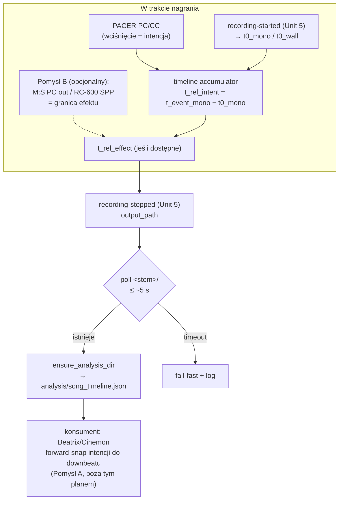

# feat: Timeline utworów/patternów w strukturze nagrania + kwantyzacja czasu

## Overview

Podczas nagrania paternologia zapisuje **timeline zmian utworu/patternu** znakowany czasem
względem startu nagrania (`t0`) do struktury nagrania (`analysis/song_timeline.json`) — paliwo dla
Beatrix/Cinemon (granice sekcji utworu, nie tylko beaty).

Kluczowa subtelność, której fundament (plan 001) nie obejmuje: **wciśnięcie przycisku PACER ≠
moment słyszalnej zmiany**. Zmiana jest kwantyzowana do granicy pętli (RC-600) i/lub patternu
(M:S), więc faktyczna zmiana następuje *w momencie wciśnięcia albo później*, do jednej długości
pętli/patternu. Kwantyzacja **zawsze opóźnia, nigdy nie wyprzedza** — to czyni problem
rozwiązywalnym jednokierunkowo. Ten plan rozdziela **intencję** (wciśnięcie) od **efektu**
(słyszalna zmiana) i utrwala oba.

Plan zależy od fundamentu z 001 (Model A, klient OBS WS z Unit 5, orchestrator z Unit 6).

## Problem Frame

(zob. origin: `docs/brainstorms/2026-05-31-midi-recording-orchestration-requirements.md`, R4)

paternologia wie live, co grane (z nasłuchu PACER), ale ta wiedza umiera, gdy gasną światła. Audio
nie niesie etykiety „to pattern X"; `metadata.json` OBS opisuje layout sceny, nie strukturę
muzyczną. PACER (PC/CC → utwór) to **jedyne** źródło informacji „co teraz grane". Bez maszynowego,
zsynchronizowanego z nagraniem zapisu post-prod (Beatrix/Cinemon) jest głuchy na strukturę utworu.

Drugi, głębszy problem: stempel wciśnięcia footswitcha wyprzedza słyszalną zmianę o ułamek–kilka
taktów (kwantyzacja sprzętowa). Naiwny zapis czasu wciśnięcia dałby timeline rozjechany względem
audio — granice sekcji w danych nie pokrywałyby się z granicami słyszalnymi.

## Requirements Trace

- **R4** (origin) — podczas nagrania zapis timeline zmian utworu/patternu znakowany czasem względem
  startu nagrania, trwale w `analysis/song_timeline.json`.
- **R4a** (pochodna) — timeline rozróżnia **czas intencji** (wciśnięcie PACER) od **czasu efektu**
  (słyszalna zmiana po kwantyzacji); konsument (Beatrix/Cinemon) dostaje wystarczające dane, by
  ustalić granicę słyszalną.

## Scope Boundaries

- **Zależy od fundamentu 001** — ten plan nie buduje Model A ani klienta OBS; zakłada Unit 5
  (zdarzenia `recording-started`/`recording-stopped`, `output_path`) i Unit 6 (orchestrator).
- **Bez** zmian w routingu clock/transport RC-600 ani plumbingu Doremidi (pomysł B nasłuchuje
  *tylko odczytowo*, nie zmienia routingu).
- **Konsumencki forward-snap (Pomysł A) jest poza tym planem** w sensie implementacji w
  Beatrix/Cinemon — tu definiujemy **kontrakt danych** (pola intencji/efektu), z którego konsument
  korzysta. Sam resolver w Cinemonie to osobna praca.
- **Bez** duplikowania `fps` — `metadata.json` (pisane przez `obs_script.py`) pozostaje single
  source of truth dla Cinemona.

## Context & Research

### Relevant Code and Patterns

- **RecordingStructureManager:** `packages/common/src/setka_common/file_structure/specialized/recording.py`.
  `ensure_analysis_dir(recording_dir)` → `<dir>/analysis`; `ANALYSIS_DIRNAME="analysis"`;
  `find_recording_structure(base_path)` (wymaga `metadata.json` + plik wideo). Wzorzec zapisu jak
  beatrix `analysis/<audio>_analysis.json`. Brak helpera dla dowolnej nazwy — pisać wprost do
  katalogu z `ensure_analysis_dir` lub dodać `get_timeline_file_path`. `ensure_analysis_dir` wymaga,
  by `recording_dir` **już istniał** (`recording.py:246-265` rzuca `InvalidPathError`).
- **Reorganizacja katalogu nagrania (krytyczne dla derywacji ścieżki):**
  `packages/obsession/src/obsession/obs_integration/obs_script.py:451-484` — na STOP `obs_script.py`
  robi `shutil.move` pliku z płaskiego `<output_dir>/<stem>.mkv` do podkatalogu
  `<output_dir>/<stem>/` i dopiero tam tworzy strukturę + `metadata.json`. `output_path` z
  websocketu (Unit 5) wskazuje ścieżkę **sprzed** przeniesienia. `find_latest_recording_file`
  używa heurystyki (pliki <30 s, `max(mtime)`) — mniej dokładnej niż `output_path`.
- **paternologia MIDI:** `midi/listener.py` (`_callback` filtruje PC `0xC0` → `SongMidiIndex.lookup`
  → `bus.publish_threadsafe`), `midi/events.py` (`MidiEvent(song_id,channel,program,timestamp)`,
  most wątek→asyncio przez `loop.call_soon_threadsafe`), `midi/index.py` (`SongMidiIndex.build/lookup`).
- **Klient OBS (z planu 001, Unit 5):** emituje wewnętrzne zdarzenia `recording-started` (payload
  eventu STARTED) i `recording-stopped` (`output_path`). To punkt zaczepienia tego planu.

### Institutional Learnings

- **Precedens dowodu timingu:** `packages/cymatic/tests/test_sync_verification.py` +
  `src/cymatic/sync_verification.py` — metodologia „beat→klatka w tolerancji N klatek, test na 48k
  i 44.1k". Wzorzec dla weryfikacji timeline (tolerancja czasu; świadomość zakresu: dowodzimy
  timingu **danych**, nie percepcji).
- **Brak `docs/solutions/`** — greenfield; brak precedensu nasłuchu wielu portów MIDI naraz.

### External References — Pomysł B (nasłuch granicy)

- **[Needs research]** Czy urządzenia kwantyzujące emitują MIDI w momencie granicy:
  - **M:S (Elektron Model:Samples):** Elektrony potrafią wysyłać Program Change out przy zmianie
    patternu (konfigurowalne w MIDI config). Jeśli włączone — granica patternu jest obserwowalna.
  - **RC-600 (Boss):** master MIDI clock; potencjalnie Song Position Pointer / Start-Stop na
    granicy pętli. Do zweryfikowania, co realnie wysyła i na którym porcie.
- Brief jawnie wyciął *forwardowanie* clocka; pomysł B to **odczytowy** nasłuch zdarzeń granicy,
  nie re-broadcast — trzymać jako osobny, opcjonalny czytnik, by nie naruszyć Model A.

## Key Technical Decisions

- **KTD-T1 — `t0` stemplowany przy evencie STARTED, dwa zegary:** subskrybując `recording-started`
  z Unit 5, zapamiętać `t0_mono = time.monotonic()` (do liczenia `t_rel`, odporne na skok NTP) ORAZ
  `t0_wall = time.time()` (do absolutnego `recording_start` ISO). NIE mieszać ról.
- **KTD-T2 — derywacja katalogu = `Path(output_path).parent / Path(output_path).stem`, NIE
  `.parent`** (powód: `shutil.move` w `obs_script.py`, zob. Context). Walidować po `stem`, nie po
  pełnej nazwie (OBS może remuxować mkv→mp4).
- **KTD-T3 — poll-z-backoffem na katalog `<stem>/` przed zapisem**, NIE tworzenie katalogu samemu
  (race z `shutil.move`). Domyślny budżet: interwał ~100 ms, max ~5 s (strojone); po przekroczeniu →
  fail-fast z logiem. `ensure_analysis_dir` wymaga istniejącego `recording_dir`.
- **KTD-T4 — kwantyzacja: intencja + efekt (Pomysł A jako kontrakt, Pomysł B jako wzbogacenie).**
  - **Capture (zawsze):** `t_rel_intent_sec` = stempel wciśnięcia PACER względem `t0`. Głupi,
    niezależny od sprzętu.
  - **Resolve (konsument — Pomysł A):** forward-snap intencji do najbliższej granicy muzycznej
    (downbeat/onset), którą Beatrix i tak wykrywa, w oknie `[t_intent, t_intent + okno_max]`
    (jednokierunkowo, bo kwantyzacja tylko opóźnia). Audio = grunt truth. Odsprzęga paternologię od
    znajomości długości pętli/patternu.
  - **Wzbogacenie (Pomysł B):** jeśli urządzenie granicy emituje MIDI (M:S PC out / RC-600 SPP),
    nasłuchać go odczytowo i zapisać `t_rel_effect_sec` bezpośrednio — dokładniejsze niż snap,
    domyka pętlę bez audio. Opcjonalny, zależny od weryfikacji sprzętu (Open Questions).
- **KTD-T5 — `recording_start` ISO obowiązkowe w pliku** — bez niego `t_rel` jest nieskorelowalny
  z `metadata.json`. **FPS NIE duplikować** (single source = `metadata.json`).
- **KTD-T6 — nie polegać na `find_recording_structure`** (wymaga `metadata.json`, pisanego dopiero
  po `shutil.move`); kluczować po wyderywowanym `<stem>/` + poll + walidacja.

## High-Level Technical Design

> *Ilustruje zamierzone podejście — wskazówka kierunkowa do recenzji, nie specyfikacja
> implementacji.*

## Implementation Units

### Unit T1: Stemplowanie `t0` i akumulacja zdarzeń intencji

**Goal:** po `recording-started` orchestrator akumuluje zmiany utworu/patternu ze stemplem
`t_rel_intent_sec`; przed startem i po stopie nic nie zbiera.

**Requirements:** R4

**Dependencies:** 001/Unit 5 (`recording-started`/`recording-stopped`), 001/Unit 6 (orchestrator)

**Files:**
- Create: `packages/paternologia/src/paternologia/recording/timeline.py`
- Modify: `packages/paternologia/src/paternologia/recording/orchestrator.py` (akumulacja, flush)
- Test: `packages/paternologia/tests/test_timeline.py` (nowy)

**Approach:**
- Subskrybując `recording-started` zapamiętać `t0_mono`/`t0_wall` (KTD-T1).
- Każda `MidiEvent`/song-change w trakcie nagrania → wpis `t_rel_intent_sec = monotonic_event −
  t0_mono`. Filtr: zdarzenia przed `t0` odrzucane.
- Na `recording-stopped` → przejście do Unit T2 (zapis).

**Test scenarios:**
- Happy path: dwie zmiany utworu w trakcie → 2 wpisy z rosnącym `t_rel_intent_sec`.
- Edge case: zmiana **przed** startem nagrania nie trafia do timeline (filtr po `t0`).
- Edge case: zero zmian → pusta lista `events`.
- Integration: `t_rel_intent` zgodne z różnicą stempli zdarzeń w granicach tolerancji (wzorzec
  cymatic).

### Unit T2: Zapis `song_timeline.json` do struktury nagrania

**Goal:** na stopie timeline ląduje w `<output_dir>/<stem>/analysis/song_timeline.json`, mimo race
z `obs_script.py`.

**Requirements:** R4

**Dependencies:** Unit T1; **założenie zewnętrzne:** `obs_script.py` (obsession) załadowany w OBS
(jego `shutil.move` do `<stem>/` jest jedynym źródłem prawdy o układzie katalogu).

**Files:**
- Modify: `packages/paternologia/src/paternologia/recording/timeline.py` (zapis + derywacja)
- Modify: `packages/paternologia/pyproject.toml` (`setka-common` — `RecordingStructureManager`)
- Test: `packages/paternologia/tests/test_timeline.py`

**Approach:**
- Derywacja katalogu wg KTD-T2; poll-z-backoffem wg KTD-T3; nie polegać na
  `find_recording_structure` (KTD-T6).
- **Precondycja:** zweryfikować realny payload `stop_record()` (ścieżka pliku vs katalog;
  ewentualny remux mkv→mp4) — walidować po `stem`.
- **Fail-fast walidacja:** przed zapisem sprawdzić, że w `<stem>/` jest plik wideo o nazwie ze
  `stem` (bez tego błędna derywacja cicho zapisałaby timeline w złe miejsce).
- **Schemat (KTD-T4/T5):**
  `{ "recording_start": "<iso z t0_wall>", "events": [ { "t_rel_intent_sec": float,
  "t_rel_effect_sec": float | null, "song_id": str, "channel": int, "program": int,
  "pattern": str | null } ] }`. `t_rel_effect_sec` wypełnia Unit T3 (Pomysł B) lub konsument
  (Pomysł A); `null` gdy nieznane. FPS nie duplikować.

**Patterns to follow:** zapis do `analysis/` jak beatrix; `RecordingStructureManager.ensure_analysis_dir`.

**Test scenarios:**
- Happy path: derywacja `<output_dir>/<stem>/analysis/song_timeline.json` (z podkatalogu `<stem>/`,
  nie z płaskiego `<output_dir>/`); `recording_start` ISO obecne.
- Edge case: dwa nagrania pod rząd → każdy timeline w swoim `<stem>/` (websocket `output_path`
  dokładniejszy niż heurystyka 30 s/mtime).
- Integration: katalog `<stem>/` jeszcze nie istnieje na flush → poll-retry doczekuje się, potem
  zapis; brak `InvalidPathError`.
- Error path: katalog nie pojawia się w limicie poll (np. `obs_script.py` wyłączony) → fail-fast z
  logiem, brak crasha orchestratora.

### Unit T3: Nasłuch granicy efektu (Pomysł B, opcjonalny)

**Goal:** jeśli urządzenie kwantyzujące emituje MIDI granicy, zapisać `t_rel_effect_sec`
bezpośrednio (dokładniej niż snap konsumencki).

**Requirements:** R4a

**Dependencies:** Unit T1/T2; **weryfikacja sprzętu** (Open Questions) — co i gdzie emitują M:S /
RC-600.

**Files:**
- Create: `packages/paternologia/src/paternologia/midi/boundary_listener.py`
- Modify: `packages/paternologia/src/paternologia/recording/timeline.py` (korelacja intencja↔efekt)
- Test: `packages/paternologia/tests/test_boundary_listener.py` (nowy)

**Approach:**
- Odczytowy listener na porcie urządzenia granicy (osobny od PACER — Model A nietknięty).
- Każde zdarzenie granicy w trakcie nagrania stempluje `t_rel_effect_sec`; korelacja z
  najbliższą poprzedzającą intencją (kwantyzacja tylko opóźnia → efekt ≥ intencja).
- Gdy port granicy niedostępny → `t_rel_effect_sec = null`, fallback na Pomysł A (konsument).

**Test scenarios:**
- Happy path: intencja `t=10.0`, granica `t=11.2` → wpis ma `t_rel_intent=10.0`,
  `t_rel_effect=11.2`.
- Edge case: granica bez poprzedzającej intencji (np. autonomiczna zmiana patternu) → wpis tylko z
  efektem lub świadome pominięcie (decyzja przy implementacji).
- Edge case: port granicy nieobecny → `t_rel_effect=null`, brak crasha.

## System-Wide Impact

- **Trzy zegary, nie dwa (ryzyko dryfu):** (1) `obs_script.py` `recording_start_time = time.time()`
  w procesie OBS; (2) paternologia `t0` z eventu STARTED (po serializacji→websocket→asyncio, dryf
  jednostki–dziesiątki ms, niegwarantowane); (3) **ukryta** pierwsza klatka pliku — ani (1) ani (2)
  nie są dokładnie `t=0` pliku, który ekstrahuje obsession i analizuje Beatrix. Reguła:
  `t_rel=0 ≡ recording_start` (event STARTED) — **bliskie ale nierówne** pierwszej klatce i
  `metadata.json:recording_start_time`. Timeline **musi** zapisać absolutny `recording_start` ISO
  do korelacji. Znany, nieskwantyfikowany offset do pierwszej klatki — udokumentować (pomiar runtime
  wzorem cymatic), nie udawać, że dryfu nie ma.
- **Kolejność STOP / „najnowszy plik":** `obs_script.py` chwyta plik heurystyką (<30 s,
  `max(mtime)`), paternologia ma dokładny `output_path` z websocketu — przy dwóch szybkich
  nagraniach pod rząd heurystyka może się rozjechać. Argument za poll-na-katalog (KTD-T3), nie za
  ufaniem, że oba procesy chwycą ten sam plik.
- **Restart w trakcie nagrania (SPOF):** 001/KTD5 (`Restart=always`) restartuje proces w ~2 s; nowy
  proces nie ma `t0` ani zakumulowanych zdarzeń, a OBS dalej nagrywa. Na STOP obsłużyć „STOP bez
  `t0`": zrekonstruować `t0` z `outputDuration` lub świadomie pominąć zapis i zalogować — nie
  zakładać, że `t0` zawsze istnieje. Timeline w pamięci ginie do następnego flush — **periodic
  flush** jako przyszłe ulepszenie (incremental write).
- **Integration coverage:** ścieżki cross-warstwowe (callback rtmidi → asyncio → zapis pliku po
  race z `shutil.move`) wymagają testów integracyjnych, nie tylko mocków.

## Risks & Dependencies

- **Zależność od 001:** ten plan nie ruszy bez działającego Unit 5/6.
- **Pomysł B zależny od sprzętu:** jeśli M:S/RC-600 nie emitują użytecznej granicy, Unit T3 odpada —
  Pomysł A (snap konsumencki) jest wtedy jedyną drogą do `t_rel_effect`.
- **Race z `shutil.move`:** mitygacja przez poll (KTD-T3); `obs_script.py` musi być włączony.
- **Utrata timeline przy restarcie:** mitygacja docelowa = periodic flush (odłożone).

## Open Questions

### Deferred to Implementation

- **Dokładny schemat** (granularność: utwór vs pattern, finalne pola) — propozycja w Unit T2;
  finalne pola przy implementacji.
- **Limit/backoff poll-a** na `<stem>/` — wartości progowe do strojenia runtime.
- **Skwantyfikowany offset `t0` → pierwsza klatka** — pomiar runtime wzorem `cymatic.sync_verification`.
- **`okno_max` forward-snapu (Pomysł A)** — najdłuższa sensowna pętla/pattern; do ustalenia z
  konsumentem (Cinemon zna tempo z Beatrix).

### Needs Research / Hardware Verification

- **Czy PACER wysyła Program Change do wyboru utworu, czy CC?** `_callback` filtruje tylko PC
  (`0xC0`); jeśli wybór jest CC-based, keying timeline nic nie złapie — zweryfikować na sprzęcie
  (dotyczy też R3 live view w planie 001).
- **Pomysł B — co i gdzie emitują urządzenia granicy?** M:S PC-out przy zmianie patternu? RC-600
  SPP/Start-Stop na granicy pętli? Na którym porcie? Bez tego Unit T3 jest spekulacją.
- **Czy snap konsumencki (Pomysł A) jest wystarczająco dokładny** bez Pomysłu B — decyzja po
  pierwszej sesji testowej.

## Phased Delivery

- **Faza T1 (Unit T1–T2):** timeline z czasem intencji w strukturze nagrania. Natychmiastowa
  wartość: granice sekcji dla Cinemona (z forward-snapem po stronie konsumenta).
- **Faza T2 (Unit T3, opcjonalna):** nasłuch granicy efektu — tylko jeśli weryfikacja sprzętu
  pokaże użyteczny sygnał i snap konsumencki okaże się za mało dokładny.

## Sources & References

- **Origin:** [docs/brainstorms/2026-05-31-midi-recording-orchestration-requirements.md](docs/brainstorms/2026-05-31-midi-recording-orchestration-requirements.md) (R4)
- **Fundament:** [docs/plans/2026-05-31-001-feat-midi-recording-orchestration-plan.md](docs/plans/2026-05-31-001-feat-midi-recording-orchestration-plan.md)
- Kod: `packages/common/.../specialized/recording.py`,
  `packages/obsession/.../obs_integration/obs_script.py` (`:451-484` reorganizacja),
  `packages/cymatic/tests/test_sync_verification.py`, `~/dev/paternologia/src/paternologia/midi/*`
- Wiki: `~/dev/music-box-wiki/wiki/{devices, connections/MIDI routing — main rig.md}`
