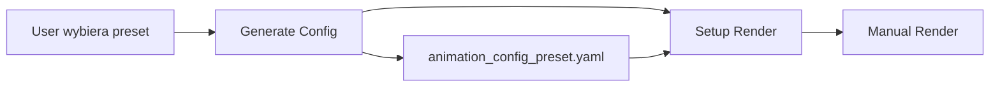

# Fermata - Migracja do Cinemon YAML Configuration System

## Przegląd

Cinemon package przeszedł migrację z environment variables na natywny system YAML configuration. Fermata wymaga aktualizacji aby korzystać z nowego 2-etapowego workflow i systemu presetów animacji.

## Problem Obecny

**Niekompatybilność z Cinemon 2.0:**
```bash
# STARE API (nie działa już):
cinemon-blend-setup recording_dir --animation-mode beat-switch

# NOWE API (wymagane):
cinemon-generate-config recording_dir --preset vintage
cinemon-blend-setup recording_dir --config animation_config_vintage.yaml
```

**Ograniczenia obecnego systemu:**
- Hardcoded `animation_mode: "beat-switch"` w process_runner.rs
- Brak możliwości wyboru presetów animacji w GUI
- Brak obsługi YAML configuration workflow
- Niekompatybilność z nowym cinemon API

## Cel Migracji

1. **Zachowanie kompatybilności** z nowym cinemon 2.0 API
2. **Rozszerzenie funkcjonalności** - wybór presetów animacji przez użytkownika
3. **Ulepszenie UX** - lepszy wybór i konfiguracja animacji w GUI
4. **Przygotowanie na przyszłość** - foundation dla zaawansowanych funkcji

## Architektura Docelowa

### Nowy Workflow (2-etapowy)



**Dostępne presety:**
- `vintage` - Classic film effects (jitter, grain, vintage color)
- `music-video` - High-energy effects (scale, shake, rotation)
- `minimal` - Clean, simple animation (basic scale on bass)

---

## ETAP 1: Podstawowa Funkcjonalność (Krytyczny)

### 1.1 Backend Changes - `process_runner.rs`

**Cel:** Zaktualizować Rust backend do 2-etapowego workflow.

**Implementacja:**

```rust
// packages/fermata/src-tauri/src/services/process_runner.rs

impl ProcessRunner {
    /// Generate YAML config and setup Blender project (2-step process)
    pub async fn run_cinemon_render(&self, recording_path: &Path, preset: &str, main_audio: Option<&str>) -> anyhow::Result<ProcessResult> {
        // Step 1: Generate YAML configuration
        log::info!("🎬 Generating cinemon config: preset={}, main_audio={:?}", preset, main_audio);
        let config_result = self.run_cinemon_generate_config(recording_path, preset, main_audio).await?;

        if !config_result.success {
            log::error!("❌ Config generation failed: {}", config_result.stderr);
            return Ok(config_result);
        }

        // Step 2: Setup Blender project with generated config
        let config_filename = format!("animation_config_{}.yaml", preset);
        let config_path = recording_path.join(&config_filename);

        if !config_path.exists() {
            return Ok(ProcessResult {
                success: false,
                stdout: String::new(),
                stderr: format!("Generated config file not found: {}", config_path.display()),
                exit_code: Some(1),
            });
        }

        log::info!("🎬 Setting up Blender project with config: {}", config_path.display());
        let mut cmd = AsyncCommand::new(&self.uv_path);
        cmd.args(&["run", "--package", "cinemon", "cinemon-blend-setup"])
            .arg(recording_path)
            .args(&["--config", &config_path.to_string_lossy()])
            .current_dir(&self.workspace_root);

        self.execute_command(cmd).await
    }

    /// Generate cinemon YAML configuration
    pub async fn run_cinemon_generate_config(&self, recording_path: &Path, preset: &str, main_audio: Option<&str>) -> anyhow::Result<ProcessResult> {
        let mut cmd = AsyncCommand::new(&self.uv_path);
        cmd.args(&["run", "--package", "cinemon", "cinemon-generate-config"])
            .arg(recording_path)
            .args(&["--preset", preset]);

        if let Some(audio_file) = main_audio {
            cmd.args(&["--main-audio", audio_file]);
        }

        cmd.current_dir(&self.workspace_root);
        self.execute_command(cmd).await
    }

    /// List available cinemon presets
    pub async fn list_cinemon_presets(&self) -> anyhow::Result<ProcessResult> {
        let mut cmd = AsyncCommand::new(&self.uv_path);
        cmd.args(&["run", "--package", "cinemon", "cinemon-generate-config", "--list-presets"])
            .current_dir(&self.workspace_root);

        self.execute_command(cmd).await
    }
}
```

**Usunąć stare metody:**
- `run_cinemon_render_with_audio()` - zastąpiona przez nową `run_cinemon_render()`

### 1.2 Commands Update - `operations.rs`

**Cel:** Zaktualizować Tauri commands aby przekazywać preset parameters.

**Implementacja:**

```rust
// packages/fermata/src-tauri/src/commands/operations.rs

#[derive(Debug, Serialize, Deserialize)]
pub struct RenderOptions {
    pub preset: String,
    pub main_audio: Option<String>,
}

impl Default for RenderOptions {
    fn default() -> Self {
        Self {
            preset: "beat-switch".to_string(),  // Zachowanie kompatybilności
            main_audio: None,
        }
    }
}

#[tauri::command]
pub async fn run_specific_step_with_options(
    recording_name: String,
    step: String,
    options: Option<RenderOptions>
) -> Result<String, String> {
    let runner = get_process_runner().await?;
    let recording_path = get_recording_path(&recording_name).await?;

    match step.as_str() {
        "setuprender" => {
            let opts = options.unwrap_or_default();
            let result = runner.run_cinemon_render(
                &recording_path,
                &opts.preset,
                opts.main_audio.as_deref()
            ).await.map_err(|e| e.to_string())?;

            if result.success {
                Ok(format!("✅ Render setup completed with preset: {}", opts.preset))
            } else {
                Err(format!("❌ Render setup failed: {}", result.stderr))
            }
        },
        _ => {
            // Zachować istniejące step handling
            run_specific_step(recording_name, step).await
        }
    }
}

#[tauri::command]
pub async fn list_animation_presets() -> Result<Vec<String>, String> {
    let runner = get_process_runner().await?;
    let result = runner.list_cinemon_presets().await.map_err(|e| e.to_string())?;

    if result.success {
        // Parse preset names from output
        let presets: Vec<String> = result.stdout
            .lines()
            .filter_map(|line| {
                if line.trim().starts_with("  ") && !line.contains("Available presets:") {
                    Some(line.trim().to_string())
                } else {
                    None
                }
            })
            .collect();
        Ok(presets)
    } else {
        Err(format!("Failed to list presets: {}", result.stderr))
    }
}
```

**Dodać do lib.rs:**
```rust
// packages/fermata/src-tauri/src/lib.rs
.invoke_handler(tauri::generate_handler![
    // ... istniejące handlers
    commands::operations::run_specific_step_with_options,
    commands::operations::list_animation_presets,
])
```

### 1.3 TypeScript Types Update

**Cel:** Dodać typy dla nowego API.

**Implementacja:**

```typescript
// packages/fermata/src/types/index.ts

export interface RenderOptions {
  preset: string;
  main_audio?: string;
}

export interface AnimationPreset {
  name: string;
  description: string;
}

export const AVAILABLE_PRESETS: AnimationPreset[] = [
  { name: "vintage", description: "Classic film effects with jitter, grain, and vintage color" },
  { name: "music-video", description: "High-energy effects for music videos with scale, shake, and rotation" },
  { name: "minimal", description: "Clean, simple animation with basic scale on bass only" },
  { name: "beat-switch", description: "Legacy compatibility mode replicating old beat-switch behavior" }
];
```

---

## ETAP 2: Rozszerzone GUI (Ważny)

### 2.1 PresetSelector Component

**Cel:** Dodać komponent do wyboru presetów animacji.

**Implementacja:**

```typescript
// packages/fermata/src/components/PresetSelector.tsx

import { Select, SelectContent, SelectItem, SelectTrigger, SelectValue } from "./ui/select";
import { AnimationPreset, AVAILABLE_PRESETS } from "../types";

interface PresetSelectorProps {
  selectedPreset: string;
  onPresetChange: (preset: string) => void;
  disabled?: boolean;
  className?: string;
}

export function PresetSelector({
  selectedPreset,
  onPresetChange,
  disabled,
  className
}: PresetSelectorProps) {
  return (
    <div className={`space-y-2 ${className}`}>
      <label className="text-sm font-medium text-gray-700">
        Animation Preset
      </label>
      <Select
        value={selectedPreset}
        onValueChange={onPresetChange}
        disabled={disabled}
      >
        <SelectTrigger className="w-full">
          <SelectValue placeholder="Select animation preset..." />
        </SelectTrigger>
        <SelectContent>
          {AVAILABLE_PRESETS.map(preset => (
            <SelectItem key={preset.name} value={preset.name}>
              <div className="flex flex-col">
                <span className="font-medium capitalize">
                  {preset.name.replace('-', ' ')}
                </span>
                <span className="text-xs text-gray-500">
                  {preset.description}
                </span>
              </div>
            </SelectItem>
          ))}
        </SelectContent>
      </Select>
    </div>
  );
}
```

### 2.2 RecordingDetails Update

**Cel:** Zintegrować preset selection z głównym workflow.

**Implementacja:**

```typescript
// packages/fermata/src/components/RecordingDetails.tsx

import { PresetSelector } from './PresetSelector';
import { RenderOptions } from '../types';

export function RecordingDetails({ recordingName, onBack, onRecordingRenamed }: RecordingDetailsProps) {
  // ... istniejące state
  const [selectedPreset, setSelectedPreset] = useState("beat-switch");
  const [showPresetConfig, setShowPresetConfig] = useState(false);

  const handleRunAction = async (action: string) => {
    if (action === 'Next Step' && recording?.next_step === 'SetupRender') {
      // Pokaż konfigurację presetów przed wykonaniem
      setShowPresetConfig(true);
      return;
    }

    if (action === 'Setup Render') {
      const options: RenderOptions = {
        preset: selectedPreset,
        main_audio: recording?.main_audio || undefined
      };

      try {
        await invoke('run_specific_step_with_options', {
          recordingName,
          step: 'setuprender',
          options
        });

        // Refresh recording details
        setTimeout(() => {
          loadRecordingDetails();
          setShowPresetConfig(false);
        }, 2000);
      } catch (error) {
        console.error('Setup render failed:', error);
      }
      return;
    }

    // Existing logic for other actions
    if (action === 'Next Step') {
      await runNextStep(recordingName);
    } else {
      await runSpecificStep(recordingName, action.toLowerCase());
    }

    setTimeout(() => {
      loadRecordingDetails();
    }, 2000);
  };

  // ... existing JSX with modifications

  return (
    <div className="p-6">
      {/* ... existing content */}

      {/* Preset Configuration Dialog */}
      {showPresetConfig && recording?.status === 'Analyzed' && (
        <div className="fixed inset-0 bg-black bg-opacity-50 flex items-center justify-center z-50">
          <div className="bg-white rounded-lg p-6 max-w-md w-full mx-4">
            <h3 className="text-lg font-semibold mb-4">Configure Animation</h3>

            <PresetSelector
              selectedPreset={selectedPreset}
              onPresetChange={setSelectedPreset}
              disabled={running}
              className="mb-6"
            />

            {recording.main_audio && (
              <div className="mb-4 p-3 bg-gray-50 rounded">
                <p className="text-sm text-gray-600">
                  <strong>Main Audio:</strong> {recording.main_audio}
                </p>
              </div>
            )}

            <div className="flex gap-3">
              <button
                onClick={() => setShowPresetConfig(false)}
                className="flex-1 px-4 py-2 text-gray-600 border border-gray-300 rounded hover:bg-gray-50"
                disabled={running}
              >
                Cancel
              </button>
              <button
                onClick={() => handleRunAction('Setup Render')}
                className="flex-1 px-4 py-2 bg-blue-600 text-white rounded hover:bg-blue-700 disabled:opacity-50"
                disabled={running}
              >
                {running ? 'Setting up...' : 'Setup Render'}
              </button>
            </div>
          </div>
        </div>
      )}

      {/* Action Buttons */}
      <div className="mt-6 space-y-2">
        {recording?.next_step && (
          <button
            onClick={() => handleRunAction('Next Step')}
            className="w-full px-4 py-2 bg-blue-600 text-white rounded hover:bg-blue-700 disabled:opacity-50"
            disabled={running}
          >
            {running ? 'Running...' : `Next Step: ${recording.next_step}`}
          </button>
        )}

        {/* Individual step buttons - existing logic */}
      </div>
    </div>
  );
}
```

### 2.3 useRecordings Hook Update

**Cel:** Dodać obsługę nowego API w hook.

**Implementacja:**

```typescript
// packages/fermata/src/hooks/useRecordings.ts

export function useRecordingOperations() {
  const [running, setRunning] = useState(false);
  const [output, setOutput] = useState('');
  const [error, setError] = useState<string | null>(null);

  const runSetupRenderWithPreset = async (recordingName: string, preset: string, mainAudio?: string) => {
    setRunning(true);
    setError(null);
    setOutput('');

    try {
      const options: RenderOptions = { preset, main_audio: mainAudio };
      const result = await invoke('run_specific_step_with_options', {
        recordingName,
        step: 'setuprender',
        options
      });

      setOutput(result as string);
    } catch (err) {
      const errorMessage = err instanceof Error ? err.message : 'Unknown error occurred';
      setError(errorMessage);
      setOutput(`Error: ${errorMessage}`);
    } finally {
      setRunning(false);
    }
  };

  // ... existing functions

  return {
    // ... existing returns
    runSetupRenderWithPreset,
  };
}
```

---

## Plan Realizacji

### Prerequisites (przed rozpoczęciem)
1. ✅ Przetestować nowe cinemon CLI commands manualnie

### Etap 1 - Implementacja (Tydzień 1)
1. **Dzień 1-2:** Backend changes (`process_runner.rs`, `operations.rs`)
2. **Dzień 3:** TypeScript types i basic API integration
3. **Dzień 4-5:** Testing i debugging podstawowej funkcjonalności

### Etap 2 - GUI Enhancement (Tydzień 2)
1. **Dzień 1-2:** `PresetSelector` component
2. **Dzień 3-4:** `RecordingDetails` integration
3. **Dzień 5:** UI/UX polish i testing

### Testing Strategy
- **Manual testing:** Każdy preset z różnymi typami recordings
- **Error handling:** Test failed config generation, missing files
- **Regression testing:** Upewnić się, że existing workflow działa
- **Cross-platform:** Test na Windows/Linux/macOS

### Success Criteria
1. ✅ Fermata może wykonać pełny workflow z każdym presetem
2. ✅ GUI umożliwia łatwy wybór presetów animacji
3. ✅ Error handling jest comprehensivny i user-friendly
4. ✅ Performance nie uległ pogorszeniu
5. ✅ Backwards compatibility zachowana (domyślnie beat-switch)

---

## Risk Mitigation


### Risk 1: Complex GUI
**Mitigation:** Implementować progressive disclosure - zaawansowane opcje ukryte początkowo

### Risk 2: Error Handling
**Mitigation:** Comprehensive error messages z suggestions for resolution

---
